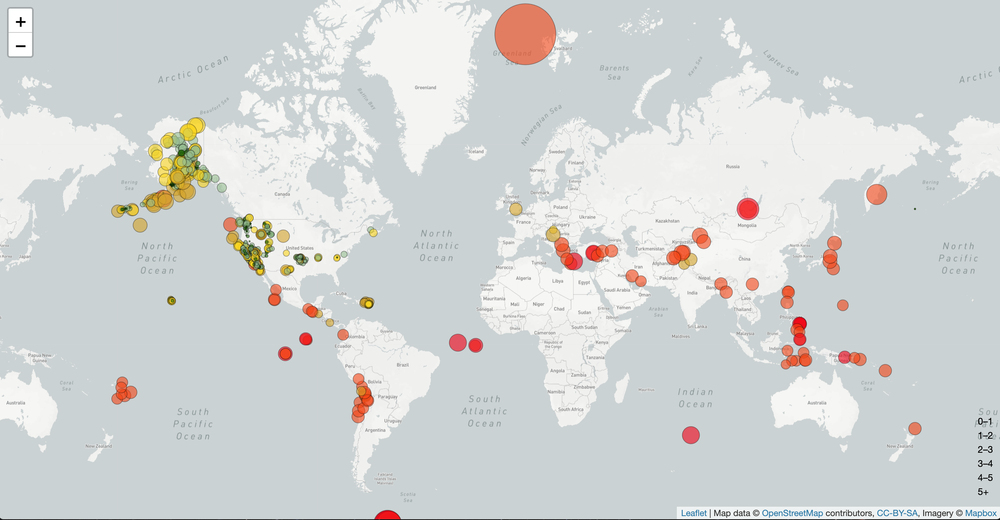
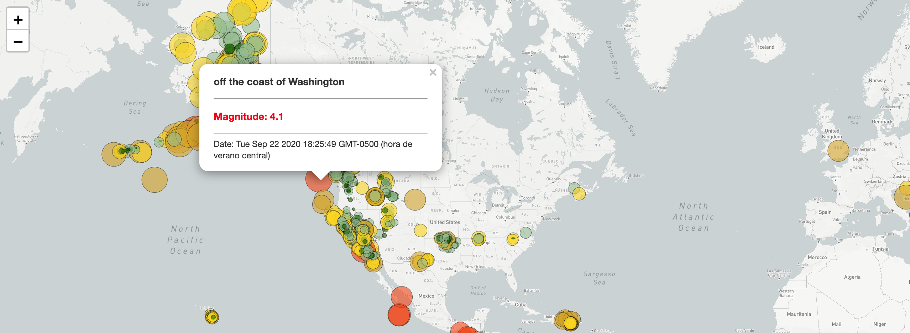

# Visualization of Earthquakes in the World

Using data from [USGS](https://earthquake.usgs.gov/earthquakes/feed/v1.0/geojson.php) I created a map that displays in a popup the magnitude, location and time of the earthquakes ocurred in the last week. The magnitude is also shown as the size and colour of a cirle.

## Built with

* Javascript
* CSS
* HTML
* Mapbox

